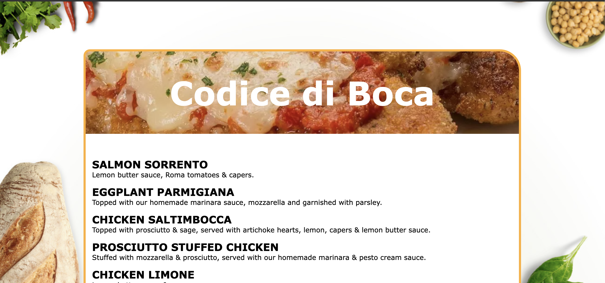

# Codice di Boca

Boca Code Week 5 Codice di Boca: This project is a web application that displays a menu of food items retrieved from an external API.

## Features
- Fetches menu items from an external API.
- Dynamically displays the menu items on the web page.

## Special thanks to
- [Boca Code](https://github.com/bocacode) for providing the learning environment and resources for this project.
- [Todd Albert](https://github.com/toddalbert) for his valuable instruction and assistance in learning and completing this project.

---
*This project was developed as part of the Boca Code curriculum.*